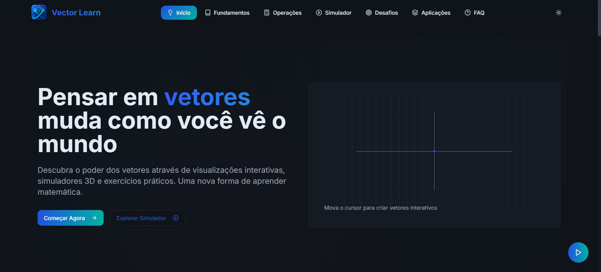

# Vector Learn 🚀

> **Uma plataforma interativa para estudantes dominarem vetores e análise espacial através de simuladores 3D, desafios práticos e gamificação.**

[](https://opensource.org/licenses/MIT)


---



*Pensar em vetores muda como você vê o mundo — Visualize, simule e domine conceitos em 3D*

**Acesse agora:** [Vector Learn](https://vectorlearn-murex.vercel.app/) | Experimente sem criar conta

---

## 🎯 O que é Vector Learn?

**Vector Learn** é uma plataforma educacional inovadora criada para transformar o aprendizado de vetores e análise espacial. Diferente dos métodos tradicionais baseados apenas em fórmulas e abstrações, a plataforma oferece uma **experiência visual, interativa e gamificada** onde estudantes podem:

✨ **Visualizar conceitos matemáticos complexos** em tempo real através de simuladores 3D  
🎮 **Interagir fisicamente** com vetores, forças e operações vetoriais  
🏆 **Competir e progredir** através de um sistema de gamificação com badges, leaderboards e desafios  
📊 **Acompanhar seu aprendizado** com dashboards detalhados de progresso  

---

##  Por que Vector Learn?

### O Problema
Estudantes de engenharia, física e computação enfrentam dificuldades ao aprender vetores porque:
- Conceitos são abstratos e difíceis de visualizar
- Fórmulas não mostram como funcionam na prática
- Falta engajamento e motivação

### A Solução
Vector Learn resolve isto através de:
- **Simuladores imersivos** que trazem abstração para a realidade visual
- **Feedback imediato** enquanto você manipula vetores e realiza operações
- **Gamificação inteligente** que transforma estudo em jornada de conquistas
- **Conteúdo progressivo** de fundamentos a aplicações avançadas

---

## ⚙️ Stack Tecnológica

Vector Learn foi arquitetada com as **tecnologias mais modernas e performáticas** da web:

| Camada | Tecnologias |
|--------|-------------|
| **Build & Development** |  Vite – Builds 10x mais rápidos e HMR instantâneo |
| **Frontend Framework** |  React 18 – Componentes reativos e otimizados |
| **Linguagem** |  TypeScript – Tipagem estática e segurança |
| **Estilização** |  Tailwind CSS + Shadcn/UI – Design System acessível |
| **3D & Animações** |  Three.js + React Three Fiber + Framer Motion |
| **Matemática & Fórmulas** | **KaTeX** – Renderização ultra-rápida de LaTeX |
| **Visualização de Dados** | **Recharts** – Dashboards limpos e responsivos |
| **Ferramentas** |    |
| **Deploy** |  Infraestrutura global |

### 🎯 Decisões Técnicas Chave

- **Vite vs CRA**: Vite oferece builds 10x mais rápidos e HMR (Hot Module Replacement) instantâneo, otimizando significativamente o fluxo de desenvolvimento
- **Three.js + React Three Fiber**: Renderização 3D de alta performance sem comprometer FPS, essencial para simuladores fluidos
- **TypeScript**: Tipagem rigorosa especialmente crítica em cálculos matemáticos vetoriais onde erros são custosos
- **Tailwind + Shadcn/UI**: Abordagem utilitária combinada com componentes base acessíveis (WCAG 2.2 AA)

---

## 🚀 Quick Start

### Pré-requisitos

* Node.js v18+
* npm, yarn ou bun

### Instalação

```bash
# Clone o repositório
git clone https://github.com/Carlos2505dev/Vector-Learn.git
cd Vector-Learn

# Instale as dependências
npm install
# ou
bun install

# Inicie o servidor de desenvolvimento
npm run dev
```

O servidor estará disponível em **http://localhost:5173**

---

## 🎮 Funcionalidades Principais

### 🕹️ Simuladores Interativos Avançados

A Vector Learn oferece múltiplos ambientes de simulação onde os estudantes experimentam conceitos em tempo real:

| Simulador | Descrição | Conceitos |
|-----------|-----------|-----------|
| 🚤 **Barco** | Interaja com vetores de propulsão e correnteza em ambiente aquático | Soma vetorial, componentes |
| 📐 **Plano Inclinado** | Visualize decomposição de forças gravitacionais em objetos em rampa | Decomposição de forças, Normal e Peso |
| 🏗️ **3D Explorer** | Manipule livremente vetores em 3D com rotação orbital e zoom | Vetores em 3 dimensões, Magnitude |
| 🔄 **Comparador** | Analise lado-a-lado magnitude, direção e operações entre vetores | Análise comparativa, Aplicações |

### 🏆 Sistema de Gamificação & Engajamento

O aprendizado se transforma em jornada de conquistas com:

- **🎖️ Badges de Desempenho**: Conquistas automáticas ao atingir marcos de aprendizado
- **🥇 Leaderboard Dinâmico**: Ranking em tempo real incentivando competição saudável  
- **🔥 Streaks & Consistência**: Contador de dias consecutivos de estudo com recompensas
- **📜 Certificados**: Geração automática ao completar trilhas de desafios
- **🎯 Desafios Adaptativos**: Quiz inteligente que se ajusta ao seu nível

### 📚 Conteúdo Educacional Progressivo

- **Fundamentos**: De escalares a vetores e operações básicas
- **Operações**: Soma, subtração, produto escalar, produto vetorial com visualização geométrica
- **Aplicações Reais**: Casos práticos em Física, Engenharia e Computação Gráfica
- **Modo de Teste**: Avaliações estruturadas com feedback automático

### 📊 Análise de Progresso

- **Dashboard Pessoal**: Visualizando seu desempenho ao longo do tempo
- **Relatórios Detalhados**: Análise de quais conceitos precisa reforçar
- **Exportação de Certificados**: Comprovação do aprendizado concluído

---

## 📁 Estrutura Detalhada do Projeto

```bash
src/
├── components/               # Componentes Modulares e Reutilizáveis
│   ├── ui/                  # Componentes base e primitivos (Shadcn/UI + Radix)
│   │   ├── button.tsx, card.tsx, dialog.tsx, etc.
│   ├── simulators/          # Motores de Simulação Física e Matemática
│   │   ├── Vector2DSimulator.tsx   # Simulador de vetores 2D interativo
│   │   ├── Vector3DSimulator.tsx   # Ambiente 3D imersivo com Three.js
│   │   ├── BoatSimulator.tsx       # Simulação: Vetores e Correnteza
│   │   └── InclinedPlaneSimulator.tsx # Simulação: Decomposição de Forças
│   ├── gamification/        # Sistema de Engajamento e Recompensas
│   │   ├── BadgeSystem.tsx         # Sistema de medalhas e conquistas
│   │   ├── Leaderboard.tsx         # Ranking global de estudantes
│   │   ├── Streaks.tsx             # Contador de dias consecutivos
│   │   └── GamificationDashboard.tsx # Dashboard de progresso do aluno
│   ├── math/                # Ferramentas de Suporte Acadêmico
│   │   ├── MathFormula.tsx         # Renderizador de LaTeX (KaTeX)
│   │   ├── EquationSolver.tsx      # Resolutor de operações passo a passo
│   │   └── VectorComparator.tsx    # Ferramenta de análise visual comparativa
│   └── layout/              # Estrutura e Experiência do Usuário (UX)
│       ├── Navigation.tsx          # Navegação inteligente e responsiva
│       ├── HeroVector.tsx          # Visualização hero interativa na Home
│       └── OnboardingTutorial.tsx   # Guia assistido para novos usuários
├── pages/                   # Views Principais e Roteamento
│   ├── Home.tsx             # Dashboard inicial e visão geral
│   ├── Fundamentos.tsx      # Conteúdo teórico e definições básicas
│   ├── Operacoes.tsx        # Prática guiada de álgebra vetorial
│   ├── Simulador.tsx        # Hub central de simuladores
│   └── Desafios.tsx         # Quiz adaptativo e Modo de Teste
├── lib/                     # Núcleo de Lógica e Utilitários
│   ├── vector-math.ts       # Engine matemática de alta precisão
│   └── utils.ts             # Funções utilitárias e helpers de estilo
├── hooks/                   # Custom Hooks para gerenciamento de estado
├── types/                   # Definições e interfaces globais TypeScript
└── index.css                # Design System, Tokens e Estilos Globais
```

---

## ⚡ Performance & Otimizações

* **Code Splitting**: Rotas e simuladores pesados são carregados sob demanda (Lazy Loading).
* **Memoization**: Uso estratégico de `useMemo` e `useCallback` para evitar re-renderizações em cálculos matemáticos intensos.
* **Tree Shaking**: Eliminação de código morto das bibliotecas de ícones e UI.
* **Asset Optimization**: SVGs inline e compressão de texturas 3D.

---

## 🗺️ Roadmap de Futuras Implementações

* [x] **Resolvedor Inteligente**: Calcula operações com vetores de forma automática e mostra o passo a passo.
* [ ] **Internacionalização (i18n)**: Suporte completo para EN, ES e PT-BR com `react-i18next`.
* [ ] **Autenticação**: Integração com Supabase Auth (Social Login e JWT).
* [ ] **Mind-Bot IA**: Chatbot para tirar dúvidas em tempo real.
* [ ] **Dashboard de Professor**: Ferramenta para gestão de turmas e acompanhamento de métricas.
* [ ] **Exportação de PDF**: Relatórios detalhados de desempenho e certificados.
* [ ] **Módulo de Cálculo II**: Integração com integrais de linha e campos vetoriais.
* [ ] **Simulador de Fluidos**: Vetores aplicados à dinâmica de fluidos.
* [ ] **Teste de nível e nivelamento**: Mini quiz para avaliar o conhecimento e adaptar a dificuldade.
* [ ] **Inserção de questões de vestibulares e Enem**: Banco de dados de questões oficiais para treinamento.
* [ ] **Inserção de Anúncios**: Estratégia de monetização via Adsense ou plataformas similares.

---

## 🤝 Contribuindo

Contribuições são o que tornam a comunidade open source um lugar incrível para aprender, inspirar e criar. Qualquer contribuição que você fizer será **muito apreciada**.

1. Fork o projeto
2. Crie sua Feature Branch (`git checkout -b feature/AmazingFeature`)
3. Commit suas mudanças (`git commit -m 'Add some AmazingFeature'`)
4. Push para a Branch (`git push origin feature/AmazingFeature`)
5. Abra um Pull Request

Veja nosso [CONTRIBUTING.md](CONTRIBUTING.md) para mais detalhes.

---

## 📄 Licença

Distribuído sob a licença MIT. Veja `LICENSE` para mais informações.

---

## ✍️ Assinatura

Desenvolvido com paixão, café e muita matemática por:

**Carlos Neto**
*Desenvolvedor Web & Mobile e Entusiasta de Tecnologias Emergentes*

---

> "Transformando abstrações em realidade visual através do código." 🚀
