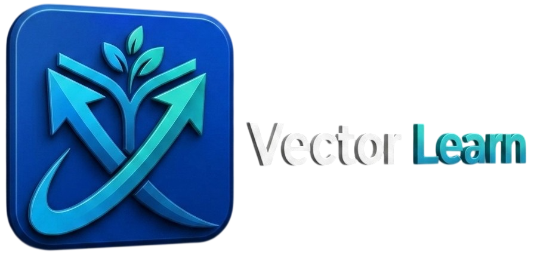
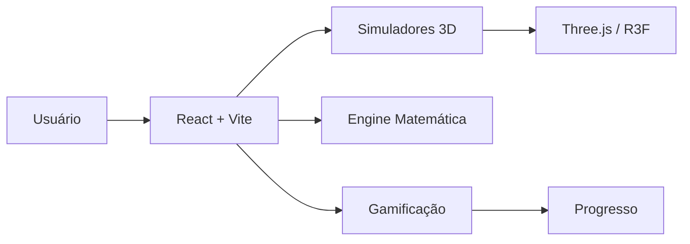
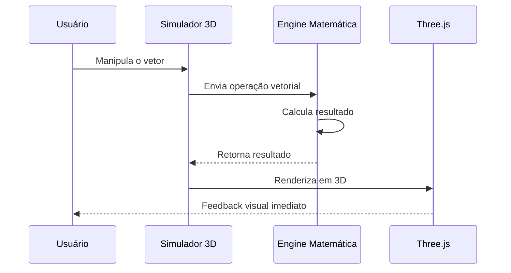

<p align="center"><a href="https://vectorslearn.vercel.app" target="_blank"></a></p>

<p align="center">
<a href="https://opensource.org/licenses/MIT"></a>
<a href="https://vectorslearn.vercel.app"></a>
<a href="https://vectorslearn.vercel.app"></a>
</p>

<p align="center">
<a href="https://skillicons.dev">
  
</a>
</p>

## Sobre o Projeto

**Vetores são decorados, não compreendidos.**

O ciclo costuma ser o mesmo: fórmula no quadro, lista de exercícios, prova com enunciado novo. Quando o enunciado muda, o raciocínio não vem. A fórmula foi memorizada, nunca visualizada.

O Vector Learn é uma plataforma para estudar vetores por simulação. Você manipula o vetor em um simulador 3D, vê o resultado na hora, resolve desafios que cobram o mesmo conceito e acompanha o próprio progresso. Tudo no navegador, sem instalação, com o progresso salvo automaticamente.

> Se você já estudou em um Toda Matéria ou Brasil Escola, já conhece essa abordagem. O que o Vector Learn soma: simuladores, desafios com questões de vestibulares e ENEM, módulo de Cálculo II e gamificação em um único lugar.

**Experimente:** [Vector Learn](https://vectorslearn.vercel.app/) · sem criar conta

## ✨ O que o Projeto faz

A plataforma hoje:

| Recurso                           | O que resolve                                    | Status                |
| --------------------------------- | ------------------------------------------------ | --------------------- |
| **Simuladores Interativos**       | Visualiza conceitos em tempo real com simulações | ✅ Pronto              |
| **Gamificação**                   | Transforma estudo em jornada de conquistas       | ✅ Pronto              |
| **Conteúdo Progressivo**          | Ensina de fundamentos a aplicações avançadas     | ✅ Pronto              |
| **Análise de Progresso**          | Mostra desempenho e lacunas de aprendizado       | ✅ Pronto              |
| **Resolvedor Inteligente**        | Resolve operações vetoriais passo a passo        | ✅ Pronto              |
| **Módulo de Cálculo II**          | Integra integrais de linha e campos vetoriais    | ✅ Pronto              |
| **Questões de Vestibular e Enem** | Treina com questões oficiais                     | ✅ Pronto              |
| **Simulador de Fluidos**          | Aplica vetores à dinâmica de fluidos             | ✅ Pronto              |
| **Internacionalização (i18n)**    | Suporte completo para EN, ES e PT-BR             | 🚧 Em desenvolvimento |
| **Mind-Bot IA**                   | Chatbot para tirar dúvidas em tempo real         | 🚧 Em desenvolvimento |
| **Inserção de Anúncios**          | Estratégia de monetização via Adsense            | 🚧 Em desenvolvimento |
| **Autenticação**                  | Integração com Supabase Auth (Social Login/JWT)  | 🗺️ Planejado         |
| **Teste de nível e nivelamento**  | Avalia conhecimento e adapta a dificuldade       | 🗺️ Planejado         |

<details>
<summary><strong>📋 Ver todos os recursos</strong></summary>

### Simuladores

* Barco: vetores de propulsão e correnteza
* Plano Inclinado: decomposição de forças gravitacionais
* 3D Explorer: manipulação livre de vetores em 3D
* Comparador: análise lado a lado de magnitude e direção
* Fluidos: vetores aplicados à dinâmica de fluidos

### Gamificação

* Badges de desempenho
* Streaks e consistência
* Desafios adaptativos
* Resolvedor Inteligente passo a passo

### Conteúdo

* Fundamentos e operações vetoriais
* Aplicações reais em Física, Engenharia e Computação Gráfica
* Modo de teste com feedback automático
* Questões de vestibulares e Enem
* Módulo de Cálculo II: integrais de linha e campos vetoriais

</details>

## 🎬 Demonstração

<p align="center">
  
</p>


<div style="display:flex;gap:14px;border-left:4px solid hsl(224 75% 50%);padding:12px 16px;border-radius:6px;background:transparent;align-items:flex-start">
  <div style="flex:0 0 44px;display:flex;align-items:center;justify-content:center">
    <div style="width:36px;height:36px;border-radius:8px;background:hsl(224 75% 95%);display:flex;align-items:center;justify-content:center;color:hsl(224 75% 50%);font-weight:700">
      <svg xmlns="http://www.w3.org/2000/svg" width="18" height="18" viewBox="0 0 24 24" fill="none" stroke="hsl(224 75% 50%)" stroke-width="2" stroke-linecap="round" stroke-linejoin="round" aria-hidden="true"><rect x="3" y="3" width="18" height="18" rx="2" ry="2"></rect><path d="M12 8v4"></path><path d="M12 16h.01"></path></svg>
    </div>
  </div>
  <div style="min-width:0">
    <div style="font-weight:600;color:hsl(224 75% 46%);margin-bottom:4px">Importante</div>
    <div>O Vector Learn roda direto no navegador, sem instalação. Para aproveitar os simuladores 3D, mantenha o <strong>WebGL habilitado</strong>. Seu progresso é salvo automaticamente no navegador.</div>
  </div>
</div>

## 📦 Instalação

### Pré-requisitos

```text
Node.js >= 18
npm, yarn ou bun
```

### Instalação

```bash
git clone https://github.com/Carlos2505dev/Vector-Learn.git

cd Vector-Learn

npm install
# ou
bun install

npm run dev
```

Abra:

```text
http://localhost:8040
```

## 🚀 Primeiros Passos

### 1. Estude os fundamentos

Abra a página **Fundamentos** e revise os conceitos básicos, de escalares a operações vetoriais.

### 2. Pratique nos simuladores

Navegue até **Simulador** e escolha entre **Barco**, **Plano Inclinado**, **3D Explorer** e **Comparador**.

### 3. Resolva desafios

Na página **Desafios**, enfrente quizzes adaptativos e o **Modo de Teste** com feedback automático.

### 4. Acompanhe seu progresso

Visualize desempenho, badges e streaks no dashboard pessoal.

A partir daí:

```text
Estudar fundamentos
    ↓
Praticar nos simuladores
    ↓
Resolver desafios
    ↓
Ganhar badges e streaks
    ↓
Acompanhar o progresso
```

## 🧠 Como Funciona

Um exemplo concreto. No resolvedor, você digita uma operação vetorial e recebe o cálculo passo a passo:

```text
(3, 2, 0) + (1, -1, 0)   →   (4, 1, 0)
(1, 2, 3) · (4, 5, 6)    →   32
2i + 3j x 1i - 2k         →   -6i + 4j - 3k
```

Cada operação é calculada por uma engine matemática pura, a mesma usada nos simuladores e nos desafios:

```ts
import { add3D } from "@/lib/math/vector-math";

const soma = add3D({ x: 3, y: 2, z: 0 }, { x: 1, y: -1, z: 0 });
// → { x: 4, y: 1, z: 0 }
```

A engine fica separada da interface, e o simulador 3D renderiza o vetor enquanto o cálculo acontece:



<details>
<summary><strong>🏗️ Detalhes da arquitetura</strong></summary>

### Componentes

| Componente                         | Responsabilidade                       |
| ---------------------------------- | -------------------------------------- |
| `src/pages`                        | Views principais e roteamento          |
| `src/components/simulators`        | Motores de simulação física e matemática |
| `src/components/math`              | Fórmulas LaTeX e resolvedor de operações |
| `src/components/gamification`      | Badges, streaks e desafios             |
| `src/components/layout`            | Navegação, hero interativo e onboarding |
| `src/lib/vector-math.ts`           | Engine matemática de alta precisão     |

### Fluxo de uma interação no simulador



### Decisão: Three.js + React Three Fiber

Three.js e React Three Fiber são usados porque simulações 3D contínuas precisam de renderização em tempo real junto com a reatividade do React.

### Decisão: TypeScript

O projeto utiliza TypeScript porque erros em cálculos matemáticos vetoriais são custosos. A tipagem rigorosa evita bugs silenciosos e melhora a manutenção.

</details>

## 🗂️ Estrutura do Projeto

```text
vector-learn/
├── .github/
├── public/
├── src/
│   ├── components/
│   │   ├── ui/
│   │   ├── simulators/
│   │   ├── gamification/
│   │   ├── math/
│   │   └── layout/
│   ├── pages/
│   ├── lib/
│   ├── hooks/
│   ├── types/
│   └── index.css
├── .gitignore
├── index.html
├── package.json
├── tailwind.config.ts
├── tsconfig.json
├── vite.config.ts
├── CONTRIBUTING.md
├── LICENSE
└── README.md
```

<details>
<summary><strong>📁 Explicação da estrutura</strong></summary>

| Caminho                       | Objetivo                                  |
| ----------------------------- | ----------------------------------------- |
| `src/components/ui`           | Componentes base (Shadcn/UI + Radix)      |
| `src/components/simulators`   | Motores de simulação física e matemática  |
| `src/components/gamification` | Badges, streaks e desafios                |
| `src/components/math`         | Fórmulas LaTeX e resolvedor de operações  |
| `src/components/layout`       | Navegação, hero interativo e onboarding   |
| `src/pages`                   | Views principais e roteamento             |
| `src/lib`                     | Engine matemática e utilitários           |
| `src/hooks`                   | Custom hooks de gerenciamento de estado   |
| `src/types`                   | Tipos e interfaces globais                |
| `public`                      | Assets estáticos                          |

### Arquitetura

O Vector Learn adota uma **arquitetura em camadas**, separando a interface do usuário da lógica de domínio:

| Camada           | Diretórios                     | Responsabilidade                            |
| ---------------- | ------------------------------ | ------------------------------------------- |
| **Apresentação** | `src/pages`, `src/components`  | Interface, simuladores e experiência do usuário |
| **Domínio**      | `src/lib/vector-math.ts`       | Regras e cálculos matemáticos vetoriais     |
| **Estado**       | `src/hooks`                    | Gerenciamento de estado e lógica reutilizável |
| **Contratos**    | `src/types`                    | Tipos e interfaces compartilhadas           |

**Por que essa arquitetura?**

- **Manutenibilidade**: cada camada evolui de forma independente. Mudanças na interface não afetam a engine matemática e vice-versa.
- **Testabilidade**: a lógica de domínio (cálculos vetoriais) fica isolada da UI, permitindo testá-la diretamente.
- **Separação de responsabilidades**: simuladores 3D, gamificação e conteúdo educacional não se acoplam entre si.
- **Escalabilidade**: novos simuladores e páginas podem ser adicionados sem reestruturar o projeto como um todo.

</details>

## ⚙️ Configurações Avançadas

<details>
<summary><strong>🔧 Variáveis de ambiente</strong></summary>

| Variável                 | Obrigatória | Descrição                      | Exemplo                 |
| ------------------------ | ----------: | ------------------------------ | ----------------------- |
| `VITE_APP_URL`           |           ✅ | URL pública da aplicação       | `http://localhost:8040` |
| `VITE_PORT`              |           ❌ | Porta do servidor de dev       | `8040`                  |
| `VITE_ENABLE_ANALYTICS`  |           ❌ | Habilita analytics opcionais   | `false`                 |

</details>

<details>
<summary><strong>🧪 Lint e build</strong></summary>

Lint:

```bash
npm run lint
```

Type-check:

```bash
npx tsc --noEmit
```

Build de produção:

```bash
npm run build
```

Preview do build:

```bash
npm run preview
```

</details>

<details>
<summary><strong>📊 Benchmarks</strong></summary>

Ambiente de referência:

```text
CPU: Apple M3
RAM: 16 GB
Node.js: 18
Navegador: Chrome
```

| Operação                          | Média    |
| --------------------------------- | -------: |
| Carregamento inicial da página    |    1,2 s |
| Renderização de fórmulas (KaTeX)  |     18 ms|
| Interação no simulador 3D         |   60 FPS |
| Alternância entre páginas         |     40 ms|

> Os números acima são apenas uma referência do ambiente descrito e não representam uma garantia de performance.

</details>

<details>
<summary><strong>🧑‍🔬 Testes</strong></summary>

Unitários:

```bash
npm test
```

E2E:

```bash
npm run test:e2e
```

Lint:

```bash
npm run lint
```

Type-check:

```bash
npx tsc --noEmit
```

> Os scripts de testes unitários e E2E ainda não estão configurados no projeto. Lint e Type-check estão disponíveis atualmente.

</details>

## 📚 Documentação

| Documento                               | Descrição          |
| --------------------------------------- | ------------------ |
| [README](./README.md)                   | Visão geral        |
| [Contributing](./CONTRIBUTING.md)       | Contribuição       |
| [Security](./SECURITY.md)               | Segurança          |
| [Code of Conduct](./CODE_OF_CONDUCT.md) | Código de conduta  |
| [License](./LICENSE)                    | Licença            |

## 🤝 Contribuindo

Todo tipo de contribuição é bem-vinda: correção de bug, simulador novo, tradução, documentação.

1. Fork o projeto
2. Crie sua Feature Branch (`git checkout -b feature/AmazingFeature`)
3. Commit suas mudanças (`git commit -m 'Add some AmazingFeature'`)
4. Push para a Branch (`git push origin feature/AmazingFeature`)
5. Abra um Pull Request

Leia o [CONTRIBUTING.md](CONTRIBUTING.md) antes de começar.

## 🐛 Reportando Problemas

Abra uma [Issue](https://github.com/Carlos2505dev/Vector-Learn/issues/new) contendo:

```text
### Descrição

Explique o problema.

### Como reproduzir

1. ...
2. ...
3. ...

### Resultado esperado

...

### Ambiente

- OS:
- Navegador:
- Versão do Vector Learn:
```

## 🔒 Segurança

Não publique vulnerabilidades de segurança em Issues públicas.

Envie um relatório para:

**[carlosbezerrajr2007@gmail.com](mailto:carlosbezerrajr2007@gmail.com)**

ou consulte [SECURITY.md](./SECURITY.md).

## ❓ FAQ

<details>
<summary><strong>O Vector Learn é gratuito?</strong></summary>

Sim. O projeto é distribuído sob a licença MIT.

</details>

<details>
<summary><strong>Preciso criar uma conta para usar?</strong></summary>

Não. É possível explorar a plataforma sem cadastro. O progresso é salvo automaticamente no navegador.

</details>

<details>
<summary><strong>Preciso instalar alguma coisa?</strong></summary>

Não. O Vector Learn roda direto no navegador, basta acessar o site. Para aproveitar os simuladores 3D, é necessário ter o WebGL habilitado.

</details>

<details>
<summary><strong>O Vector Learn envia meus dados para terceiros?</strong></summary>

Não por padrão. Não há analytics ou telemetria de terceiros habilitados na aplicação.

</details>

<details>
<summary><strong>Posso usar em produção?</strong></summary>

Sim. A aplicação já está em produção, mas novas funcionalidades ainda podem sofrer mudanças antes de versões futuras.

</details>

<details>
<summary><strong>O Vector Learn substitui professores ou aulas?</strong></summary>

Não é esse o objetivo.

O Vector Learn é uma ferramenta complementar que torna vetores visíveis e interativos, apoiando estudantes de engenharia, física e computação.

</details>

## 📜 Licença

Este projeto está licenciado sob a **MIT License**.

Consulte [LICENSE](./LICENSE).

## 💙 Agradecimentos

Obrigado a cada estudante que testou a plataforma, enviou feedback e apontou o que faltava. Obrigado aos professores de física e matemática que tornam vetores interessantes fora da tela. E obrigado antecipado a quem contribuir com código, documentação, traduções e testes.

<div align="center">

  

  <p><em>Transforme abstrações em realidade visual.</em></p>

  <p>
    <a href="https://vectorslearn.vercel.app"></a>
    <a href="https://opensource.org/licenses/MIT"></a>
  </p>

  <p>
    <a href="https://github.com/Carlos2505dev/Vector-Learn">GitHub</a> •
    <a href="https://vectorslearn.vercel.app">Aplicação</a>
  </p>

  <p><a href="#readme">⬆ Voltar ao topo</a></p>

</div>
